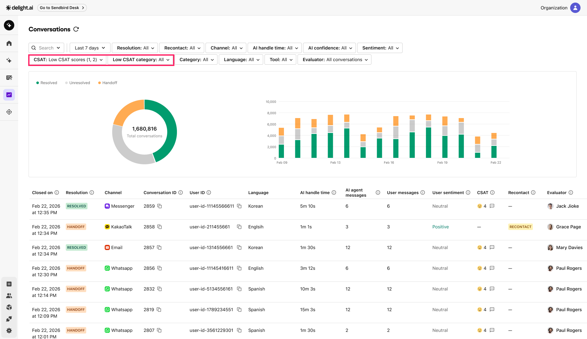
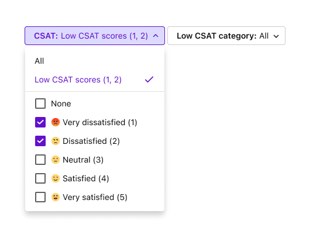
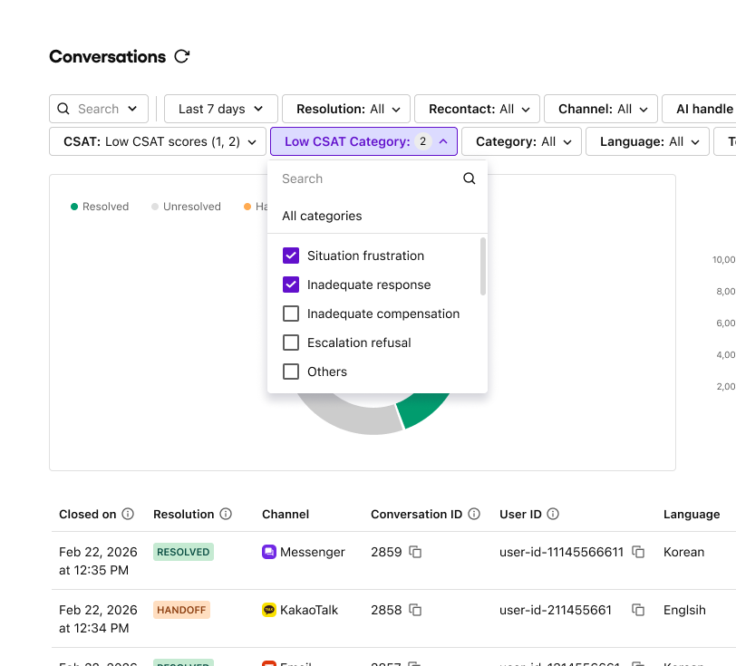
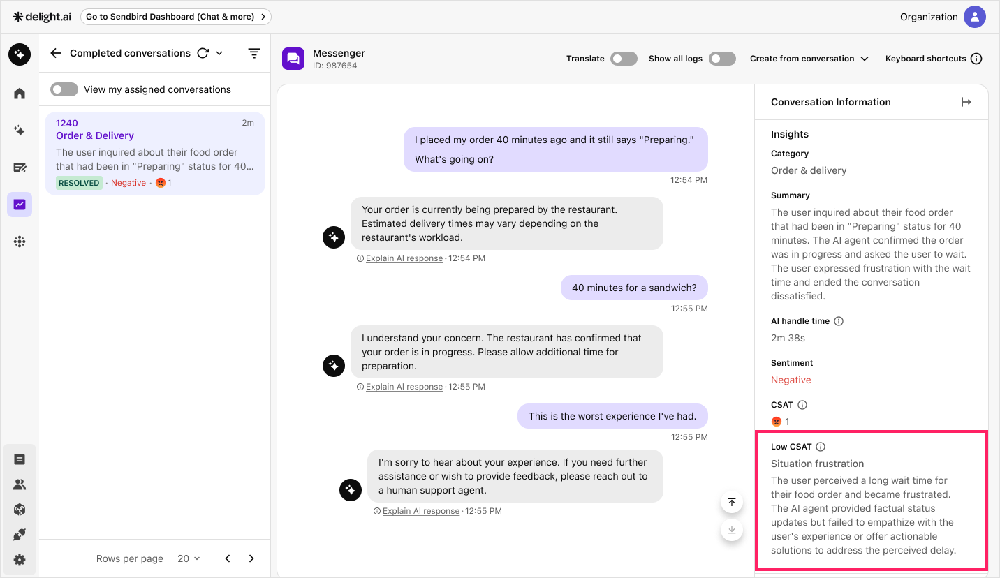

# Low CSAT

In Delight AI agent, the low customer satisfaction (CSAT) feature helps you identify conversations where customers rated one or two on the CSAT survey. When a customer submits a low score, the AI agent automatically analyzes the conversation and assigns up to two categories that explain the likely cause of dissatisfaction.

Instead of manually reviewing each conversation, you can filter by dissatisfaction category and check the AI-generated reason to understand what went wrong.

<figure><figcaption></figcaption></figure>

---

## Filter low CSAT conversations

1. Navigate to **Evaluate** > **Conversations**.
2. Click the **CSAT** filter dropdown and select **Low CSAT**. The list updates to show only conversations with a score of one or two.

<figure><figcaption></figcaption></figure>

3. After selecting **Low CSAT**, a **Low CSAT category** filter appears. Select one or more categories to narrow the results.

<figure><figcaption></figcaption></figure>

4. To narrow results further, apply the **AI confidence** or **Date range** filters.

---

## View low CSAT insights

Click a conversation in the filtered list to open its detail view. For conversations with a CSAT score of one or two, the **Insights** panel on the right displays a **Low CSAT** section with the category and reason for the dissatisfaction.

<figure><figcaption></figcaption></figure>

---

## Low CSAT categories

The AI agent classifies low CSAT conversations into the following five categories. A single conversation can have up to two categories, listed in order of impact.

| Category | Description |
|----------|-------------|
| Inadequate compensation | Dissatisfaction with compensation offered, such as coupons or refunds. |
| Inadequate response | AI agent's response did not adequately address the customer's question. |
| Escalation refusal | Customer declined the offer to connect with a human agent. |
| Situation frustration | Frustration with external factors such as delays or service quality issues. |
| Others | Does not fall under any of the above categories. |


The low CSAT classification is available only for conversations created after March 3, 2026.

