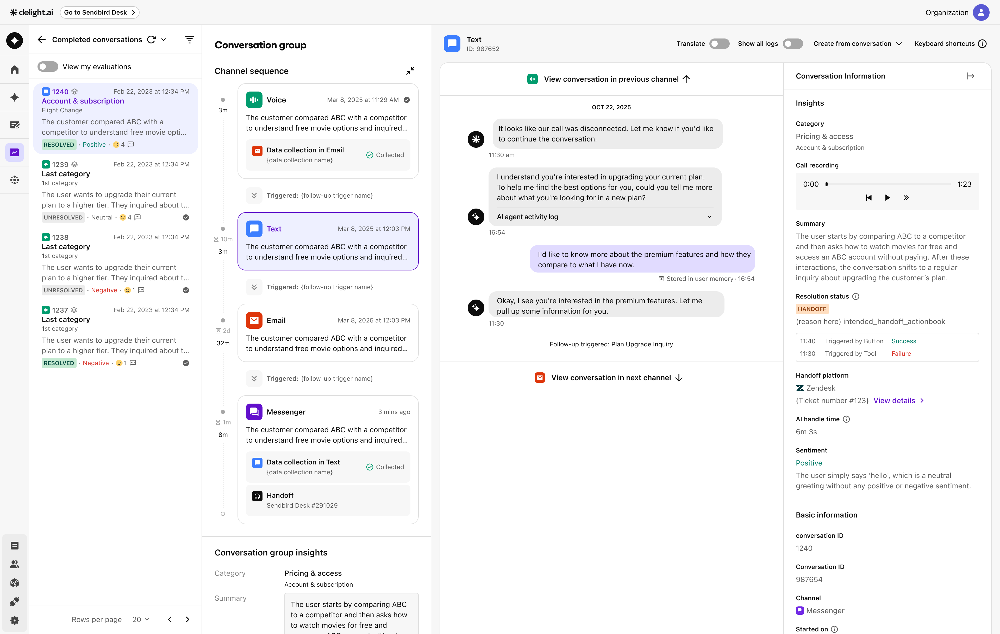

# Memory

AI agent keeps track of conversations with a user and turns key points into **Memories**. These memories help AI agent to provide more personalized and on-point service to users by referencing conversation history.

***

## How it works

AI agent can create and store memories from the past conversations with a specific user. The number of reference conversation can be set by Delight team. By default, AI agents can access  five recent conversations.


To adjust the number of reference conversations, contact our Delight representative.


Memory access / Roles and permissions

## Memory type

<table><thead><tr><th width="264.28515625">Type</th><th>Examples</th></tr></thead><tbody><tr><td>Background</td><td>City of residence, Family member</td></tr><tr><td>Preferences</td><td>Allergies, Apparel sizes</td></tr><tr><td>Experiences</td><td>Promotion, Birthday, Accident history</td></tr><tr><td>Needs and intents</td><td>Lease, contract, event due date</td></tr><tr><td>Business-specific information</td><td>Recent purchase, upcoming appointment</td></tr></tbody></table>

## User information

The AI agent can gather conversation snippets to build a personalized database for each. These snippets are called **Memories**. Building memories enables the agent to deliver tailored customer support and optimize the consultation process by understanding each user's unique characteristics. Navigate to **Workspace settings > Users > User list** to access and manage user memories in each user's **User details** view.

<figure><figcaption></figcaption></figure>

***

### Personalize with AI

AI agents can utilize these memories when sending hyper-personalized messages. This feature is called [**Personalize with AI**](../build/channels/messenger/conversation-settings/for-you-conversation.md). By using a [**Tools**](../shared-assets/tools.md) call and AI instructions, the agents can deliver engaging messages tailored to the user's specific needs and preferences.

<figure><figcaption></figcaption></figure>

Personlized messages are currently available whenever a welcome message is delivered to users. Supported features include:

* [Follow-up triggers](../shared-assets/follow-up-triggers.md)
* Messenger channel's [Conversation settings](../build/channels/messenger/conversation-settings/)
